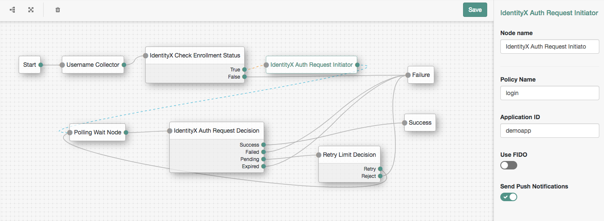
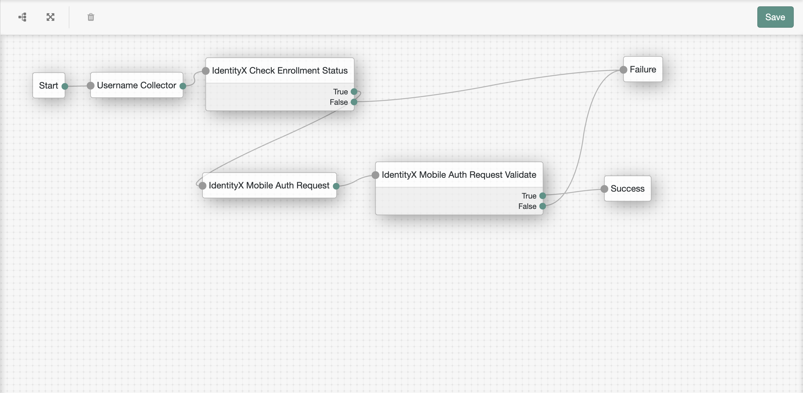
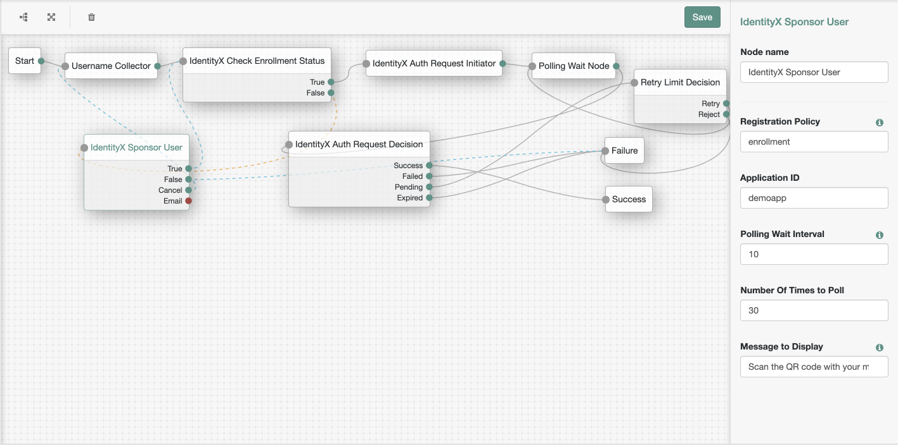
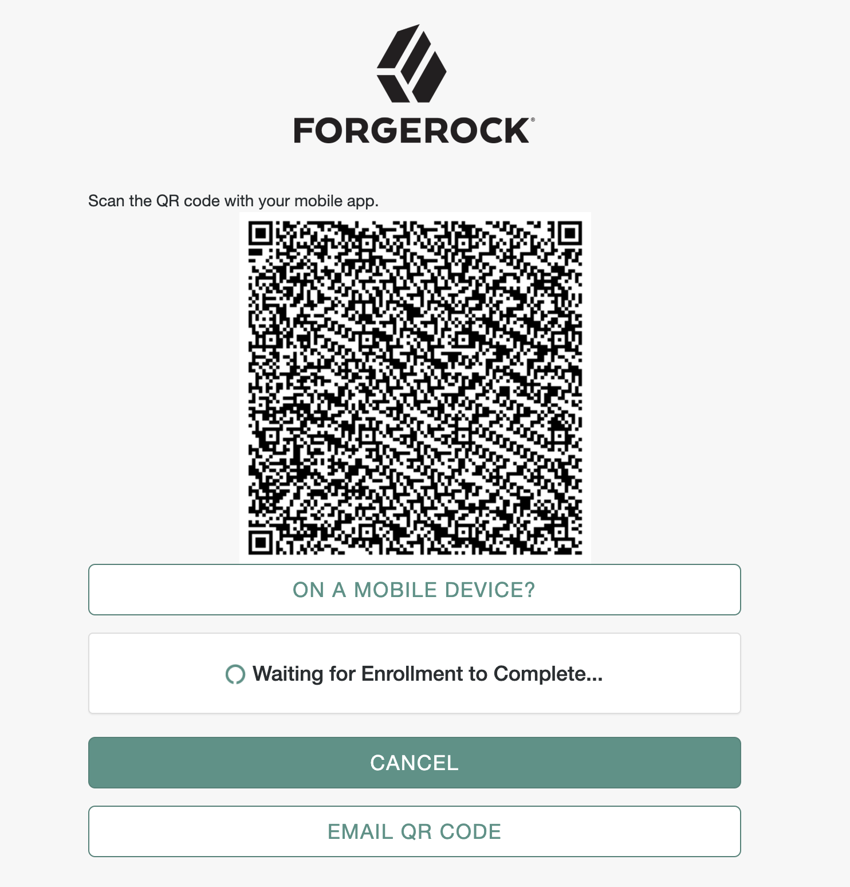

# Daon IdentityX Authentication Nodes

Daon's IdentityX platform is helping customers across the globe ditch passwords and deliver world-class customer experience by leveraging biometrics. This set of nodes allows ForgeRock customers to easily add biometrics to their authentication trees.

## About Daon ##
Daon, [www.daon.com](www.daon.com), is an innovator in developing and deploying biometric authentication and identity assurance solutions worldwide. Daon has pioneered methods for securely and conveniently combining biometric and identity capabilities across multiple channels with large-scale deployments that span payments verification, digital banking, wealth, insurance, telcos, and securing borders and critical infrastructure. Daon's IdentityX® platform provides an inclusive, trusted digital security experience, enabling the creation, authentication and recovery of a user’s identity and allowing businesses to conduct transactions with any consumer through any medium with total confidence. Get to know us on [Twitter](https://twitter.com/DaonInc), [Facebook](https://www.facebook.com/humanauthentication) and [LinkedIn](https://www.linkedin.com/company/daon).

## Installation ##
Download the current release [here](https://github.com/JBeloncik/idx-auth-request-node/releases/latest)

Copy the jar file into the ../web-container/webapps/openam/WEB-INF/lib directory where AM is deployed.  Restart the web container to pick up the new node.  The nodes will then appear in the authentication trees components palette.

## USING THE NODES IN YOUR TREE ##

### There are 6 nodes included ###
- **IdentityX Check Enrollment Status** This node makes a REST API call to IdentityX to ensure the username provided is enrolled. This node contains the configuration parameters for the IdentityX Rest Services, so it is required to be added to the tree in order for the other nodes to work.
- **IdentityX Auth Request Initiator** This node makes a REST API call to IdentityX to generate an authentication request for an 
out of band authentication flow.
- **IdentityX Auth Request Decision** This node makes a REST API call to IdentityX to check the status of an authentication request
 for an out of band authentication flow.
- **IdentityX Mobile Auth Request** This node makes a REST API call to IdentityX to generate an authentication 
request for an end user authenticating on a mobile device, and passes it to the mobile device.
- **IdentityX Mobile Auth Request Validate** This node accepts a signed authentication request from a mobile device 
 and makes a REST API call to IdentityX to validate the signed authentication request.
- **IdentityX Sponsor User** This node enables sponsorship (enrollment) of an end user.

### CONNECTING TO AN IDENTITYX SERVER ###
The nodes must be configured to connect to an IdentityX server. Contact your Daon representative for connection details.

### Configuration Parameters ###
IdentityX Check Enrollment Status contains the following configurable parameters:
- **pathToKeyStore** full path to the .jks keystore file
- **pathToCredentialProperties** full path to the credential.properties file
- **jksPassword** password for the .jks keystore file
- **keyAlias** key alias used in the .jks keystore
- **keyPassword** key password for the .jks keystore

**Note**: The Key Store and Credential Properties files should be retrieved from your Daon IdentityX instance. Please 
reach out to Daon support for help getting these files.

IdentityX Auth Request Initiator contains the following configurable parameters:
- **policyName** name of the authentication policy which should be used
- **applicationId** name of the application which should be used
- **isFidoRequest** whether to generate a FIDO or traditional IdentityX authentication request
- **sendPushNotification** whether a push notification should be sent by the IdentityX server

IdentityX Mobile Auth Request contains the following configurable parameters:
- **policyName** name of the authentication policy which should be used
- **applicationId** name of the application which should be used

The image below shows an example authentication tree using IdentityX nodes in an out of band flow.

The image below shows an example authentication tree using IdentityX nodes in a mobile flow.

The image below shows an example enrollment and authentication tree using IdentityX nodes in an out of band flow.

### Authenticating  ###
The IdentityX Check Enrollment Status node expects a username to be provided in sharedState. In the example tree above, a simple username collector is used. The IdentityX Auth Request Initiator will then call IdentityX to generate an authentication request for the provided username. Once created, the IdentityX Auth Request Decision is used to check the status of the authentication request. A polling wait node and retry decision node can be used to poll for the status. Once the user successfully authenticates on their mobile device, the status will change to SUCCESS.

The user must authenticate using a mobile app which has been built using the IdentityX FIDO Client SDK.

## Enrollment ##
The IdentityX Sponsor User node adds API calls and logic to allow optional registration in IdentityX as a part of the 
authentication tree. This allows the end user to scan a QR code with their mobile device camera to create a new identity in IdentityX and enroll biometrics.

This builds upon the existing flow shown above used for authentication.

## SUPPORT ##
For more information on this node or to request a demonstration, please contact:
Frank Gasparovic - frank.gasparovic@forgerock.com or Jason Beloncik - jason.beloncik@daon.com